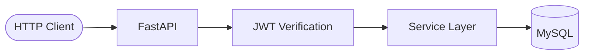

Periodico Backend provides the server-side foundation for a digital newspaper platform. It exposes a REST API for managing articles, sections, users, and media — built with FastAPI, secured with JWT Bearer tokens, and backed by a MySQL database.

## Architecture

The backend is composed of four main layers:

- **API layer** — FastAPI routers handle HTTP requests and response serialization. CORS is enabled for all origins, supporting browser-based clients out of the box.
- **Security layer** — JWT tokens (HS256) are issued at login and verified on protected endpoints. Passwords are hashed with bcrypt before storage.
- **Service layer** — Business logic is organized into service modules per resource domain (users, posts, sections, media, admin).
- **Database layer** — MySQL accessed via `pymysql` with a context-manager connection pattern that handles transactions and rollback automatically.

## Key features

- **JWT Bearer authentication** with 12-hour token expiry and HS256 signing
- **Role-based access control** — admin and regular user roles encoded directly in the JWT payload
- **Password validation** — enforces minimum 8 characters, at least one uppercase letter, one lowercase letter, and one digit
- **CORS middleware** — accepts requests from any origin with full method support
- **Five resource domains** — Posts, Sections, Users, Media, and Admin operations
- **Context-managed database connections** — automatic commit, rollback, and connection cleanup per request

## API resources

<CardGroup cols={3}>
  <Card title="Posts" icon="newspaper" href="/api/posts/get-all">
    Create, read, update, and delete newspaper articles. Supports filtering by section and author.
  </Card>
  <Card title="Sections" icon="folder" href="/api/sections/get-all">
    Manage editorial sections that organize posts into categories.
  </Card>
  <Card title="Users" icon="user" href="/api/users/register">
    Register accounts, authenticate, and manage user profiles.
  </Card>
  <Card title="Media" icon="image" href="/api/media/upload-image">
    Upload and retrieve media assets associated with posts.
  </Card>
  <Card title="Admin" icon="shield" href="/api/admin/get-all-users">
    Administrative operations restricted to users with the admin role.
  </Card>
</CardGroup>

## Next steps

<CardGroup cols={2}>
  <Card title="Quickstart" icon="rocket" href="/quickstart">
    Clone the repo, configure environment variables, and make your first API call in minutes.
  </Card>
  <Card title="Authentication" icon="key" href="/authentication">
    Understand how JWT tokens are issued, validated, and used across the API.
  </Card>
</CardGroup>
